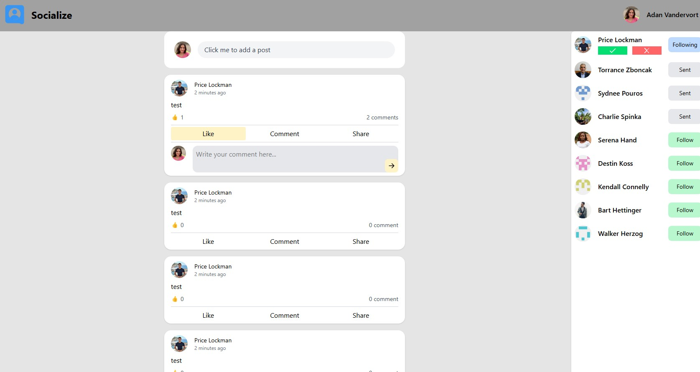
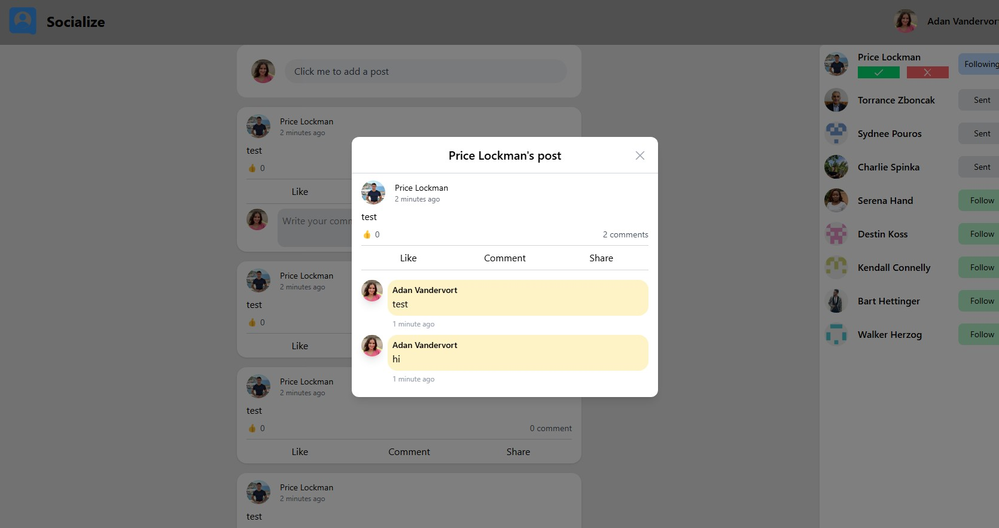
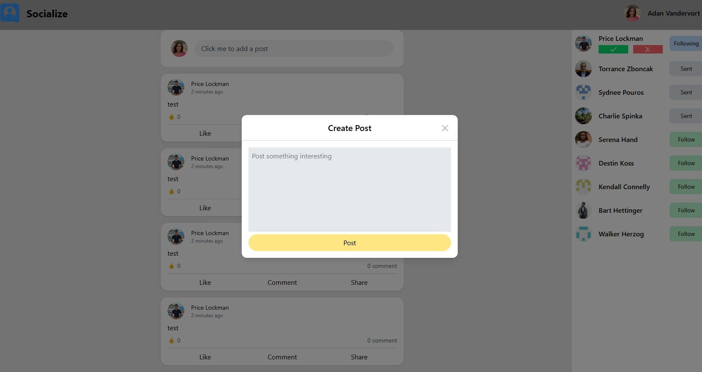
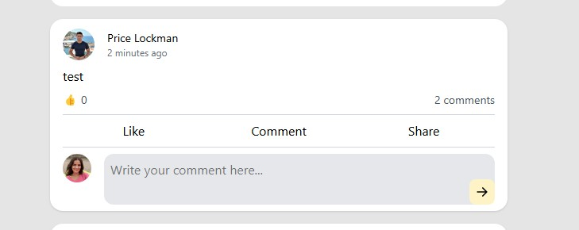

# odin-book

A social media clone focusing on backend

## Core functionality

# Build it in order
Homepage

Post

Create Post dialog

Comment post

1. Auth (passport-local) ✅
2. Posts CRUD ✅
3. Send/Reject follow requests / Follow/Unfollow ✅
4. Like posts ✅
5. Comments ✅

Users must sign in to see anything except the sign-in page. ✅
Users should be able to sign in using your chosen authentication method. ✅
Users can send follow requests to other users. ✅
Users can create posts (begin with text only). ✅
Users can like posts. ✅
Users can comment on posts. ✅
Posts should always display the post content, author, comments, and likes. ✅
There should be an index page for posts, which shows all the recent posts from the current user and users they are following.
Users can create a profile with a profile picture.
A user’s profile page should contain their profile information, profile photo, and posts.
There should be an index page for users, which shows all users and buttons for sending follow requests to users the user is not already following or have a pending request. ✅
Deploy your app to a hosting provider of your choice!
